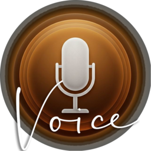

# SprichKlartext 🎙️✨

> **Premium Diktat-Erfahrung mit organischen schwebenden Bubbles & mobiler Fernbedienung.**

SprichKlartext ist eine hochmoderne Speech-to-Text Anwendung für Windows, die Ästhetik und Funktion vereint. Deine gesprochenen Worte erscheinen als sanft schwebende Bubbles in einem warmen, premium Design.

## ✨ Highlights

- 🫧 **Organisches UI**: Diktate werden in flüssig animierten (50 FPS) "Floating Bubbles" visualisiert.
- 📱 **Mobile Remote Mic**: Nutze dein Smartphone als hochwertiges Mikrofon – ganz ohne App-Installation (PWA).
- 🧠 **Intelligente Sprachbefehle**: Automatische Ausführung von Aktionen wie "Löschen", "Suchen" oder "Kopieren" per Sprache.
- 🎨 **Premium Aesthetic**: Harmonische "Organic Warm" Farbpalette (Kupfer, Gold, Braun) mit subtilen Glaseffekten.
- 🚀 **Whisper-Powered**: Hochpräzise Transkription direkt auf deinem Rechner.

## 🛠️ Tech-Stack

- **Core**: Python & CustomTkinter (Desktop UI)
- **Engine**: OpenAI Whisper (Local AI Transcription)
- **Bridge**: Flask & Socket.io (Mobile Connectivity)
- **Design**: Modernes Glassmorphism-Konzept

## 💡 Sprachbefehle

| Befehl | Aktion |
| :--- | :--- |
| "löschen" | Entfernt den letzten Satz |
| "kopieren" | Kopiert alles in die Zwischenablage |
| "suchen [text]" | Startet eine Google-Suche |
| "neue zeile" | Fügt einen Zeilenumbruch ein |

Download the SprichKlartext_Setup_Final.exe and run the installer. 
