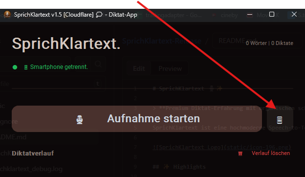
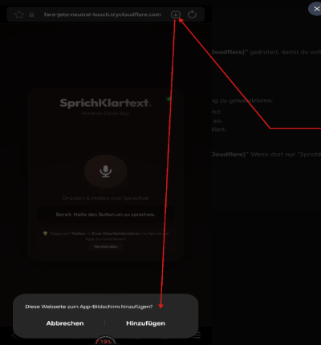
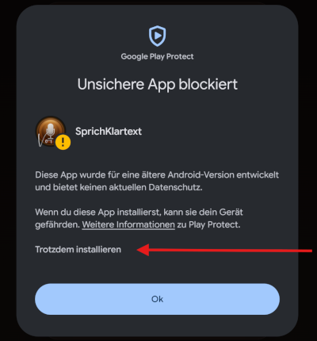

# SprichKlartext 🎙️✨

> **Premium Diktat-Erfahrung mit organischen schwebenden Bubbles & mobiler Fernbedienung.**

"SprichKlartext. APP" revolutioniert deine Schreiberfahrung. Deine gesprochenen Worte werden nicht einfach nur transkribiert, sondern erscheinen als sanft schwebende Bubbles in einem warmen, eleganten Design. Nutze dein Smartphone als hochwertiges Remote-Mikrofon und erlebe eine nahtlose Verbindung zwischen Ästhetik und modernster KI-Technik.

## ✨ Highlights

- 🫧 **Organisches UI**: Diktate werden in flüssig animierten (50 FPS) "Floating Bubbles" visualisiert.
- 📱 **Mobile Remote Mic**: Nutze dein Smartphone als hochwertiges Mikrofon – ganz ohne App-Installation (PWA).
- 🧠 **Intelligente Sprachbefehle**: Automatische Ausführung von Aktionen wie "Löschen", "Suchen" oder "Kopieren" per Sprache.
- 🎨 **Premium Aesthetic**: Harmonische "Organic Warm" Farbpalette (Kupfer, Gold, Braun) mit subtilen Glaseffekten.
- 🚀 **Whisper-Powered**: Hochpräzise Transkription direkt auf deinem Rechner.

## Funktioniert 

- 🔷 **Windows Programme**: in Cursor/ Antigravity/ Editor/ Notpad++/ Word/ Browser/
-  🫵 Funktioniert auch hier bei GitHub/ im Edit
- ✨ Überall dort wo du den cursor | platziert hast, einfach praktisch!! 😁

## 🛠️ Tech-Stack

- **Core**: Python & CustomTkinter (Desktop UI)
- **Engine**: OpenAI Whisper (Local AI Transcription)
- **Bridge**: Flask & Socket.io (Mobile Connectivity)
- **Design**: Modernes Glassmorphism-Konzept

## 💡 Sprachbefehle

| Befehl | Aktion |
| :--- | :--- |
| "löschen" | Entfernt den letzten Satz |
| "kopieren" | Kopiert alles in die Zwischenablage |
| "suchen [text]" | Startet eine Google-Suche |
| "neue zeile" | Fügt einen Zeilenumbruch ein |

## 🫧 SprichKlartext_Setup_Final.exe herunterladen und installieren. 
- Nach Appstart auf Mobile Icon 👇rechts klicken und QR-Bild mit Smartphoen scanen.

- Ein neuer Browser-Tab auf dem Smartphone wird geöffnet. Jetzt kannst du die App auf den Hauptbildschirm verknüpfen/ durch Installieren der Web-App. Click in auf das ⬇️

- Warnhinweis Ignorieren da Google Play Protect / die app-url nicht kennt und als unsicher markiert...

## 🛠️ Fehlerbehebung (FAQ)

**Q: Mein Smartphone zeigt "Verbindung nicht möglich".**
A: Stelle sicher, dass die Desktop-App den Status "v1.5 [Cloudflare]" anzeigt. Der Tunnel benötigt ca. 5-10 Sekunden nach dem Start, um bereit zu sein.

**Q: Der QR-Code erscheint nicht.**
A: Überprüfe deine Internetverbindung. Die Cloudflare-Infrastruktur muss für die Fernbedienung erreichbar sein.

**Q: Kann ich die App auf dem Handy-Startbildschirm speichern?**
A: Ja, aber da sich die Adresse aus Sicherheitsgründen bei jedem Start ändert, empfehlen wir bei jedem neuen Diktat-Durchgang einen kurzen Scan des QR-Codes. Danach kannst du wieder wie oben in den Bildern erklärt vorgehen.

---
*Entwickelt für Menschen, die Ästhetik ebenso schätzen wie Effizienz.* 💭✨
